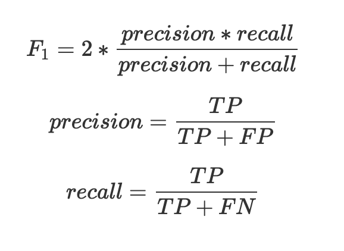

# 이미지분류 경진대회

- `부스트캠프 AI Tech 1기` 과정 중, `P stage 1` 기간 동안 참여한 이미지 분류 경진대회 소스코드 입니다.
- 대회기간: `2021.03.` ~ `2021.04` (2 weeks)

## 대회 설명

- 얼굴을 정면으로 찍은 사진이 입력으로 주어집니다. (총 18,000장)
- `마스크 정상 착용 여부(3)` * `나이대(3)` * `성별(2)` = 18 classes
- 총 18개의 클래스로 이미지를 분류하는 경진대회입니다.
- 평가지표는 `f1-score`를 사용합니다.

## 결과

<!-- #### Public LB Score  
  

#### Private LB Score
     -->
  
- **Public LB Score**
  - Accuracy: `81.2381%`
  - F1-score: `0.7716`
  - Rank: **21등** `(21/223)`
- **Private LB Score**
  - Accuracy: `80.3651%`
  - F1-score: `0.7541`
  - Rank: **28등** `(28/223)`

## 데이터 설명

- 대상: 아시아인 남녀, 20대~70대
- 전체 사람 수 : 4,500
- 한 사람당 사진의 개수: 7
  - 마스크 정상 착용: 5장
  - 마스크 불량 착용: 1장
  - 마스크 미착용: 1장
- 이미지 크기: (384, 512)

데이터 상세 Description 보기

  ### 학습데이터, 테스트 데이터

  - 데이터 분할
    - 학습데이터 60%
    - public 테스트셋 20%
    - private 테스트셋 20%

  ### 입출력

  - 입력: 마스크 착용 사진, 미착용 사진, 혹은 이상하게 착용한 사진(코스크, 턱스크)
  - 출력: 총 18개의 class를 예측해야합니다. 결과값으로 0~17에 해당되는 숫자가 각 이미지 당 하나씩 나와야합니다.
    

    
예시

    

    - the class of `cfe1268.jpg` : 7  
    - the class of `3a2662c.jpg` : 2

    

    

  ### 클래스 분류 기준

  - 마스크 착용여부, 성별, 나이를 기준으로 총 18개의 클래스가 있습니다.
    

    
상세 분류 기준 보기

    

    

    

    

## 평가방식

- Submission 파일을 채점서버에 올리면, F1-Score를 기준으로 결과를 보여주는 방식입니다.
- 평가기준: F1-score
  
<!-- $$F_1 = 2 * {{precision * recall} \over {precision + recall}}$$
$$precision = {TP \over {TP + FP}}$$
$$recall = {TP \over {TP + FN}}$$ -->

 

## 시도한 방법들 및 결과

| Index 	| Model(Backbone) 	| Trial 	| Score 	|
|:---:	|:---:|---	|---	|
| 1 	| VGG11 	|  	| - Accuracy: 45.8600% - F1-score: 0.3300 	|
| 2 	| ResNet50 	| - Adam optimizer - CE loss 	| - Accuracy: 54.2500% - F1-score: 0.5400 	|
| 3 	| EfficientNet b4 	| - Random-crop(256, 128) - AdamP optimizer - Focal loss 	| - Accuracy: 73.6984% - F1-score: 0.6986 	|
| 4 	| ResNet50 	| - Age filter(58) - CenterCrop(380,380) - MADGRAD optimizer 	| - Accuracy: 73.6984% - F1-score: 0.7206 	|
| 5 	| EfficientNet b4 	| - CLAHE(전처리) - Age filter(58) - CenterCrop(380,380) - Label smoothing loss(0.05) - MADGRAD optimizer 	| - Accuracy: 79.2857% - F1-score: 0.7493 	|
| 6 	| EfficientNet b4 	| - Face-crop Augmentation - Age filter(58) - Label smoothing loss(0.05) - MADGRAD optimizer 	| - Accuracy: 80.0952% - F1-score: 0.7582 	|
| 7 	| EfficientNet b4 	| - Age filter(58) - Label smoothing loss(0.05) - MADGRAD optimizer 	| - Accuracy: 80.8730% - F1-score: 0.7681 	|
| 8 	| EfficientNet b4 	| - Age filter(58) - Label smoothing loss(0.05) - MADGRAD optimizer + fine tuning(SGD) 	| - Accuracy: 81.2381% - F1-score: 0.7716 	|

 

## 소스코드 설명
  
### Efficientnet_b4

- efficientnet b4 pretrained model 사용
- loss function을 바꿔가며 실험
- optimizer로 Adamp, MADGRAD 사용해봄
- Age Filter: 60세 이상 그룹의 레이블을 임의로 58세 이상 데이터로 조정하여 사용

### K_fold_Efficientnet_b4

- 위의 Efficientnet_b4 구조에 K-fold를 추가
- dataset.py > MaskSplitByStratifiedProfileDataset 클래스 추가 구현

### Resnet50

- Resnet50 pretrained model 사용하여 전이학습

### VGG11

- VGG11 pretrained model 사용하여 전이학습

### CLAHE

- Contrast Limited Adaptive Histogram Equalization
- 타일(8*8)단위 이미지 히스토그램 균일화
- 타일간 경계부분은 Bilinear interpolation 적용
- 이미지 히스토그램 균일화를 사용하여 데이터셋 생성

### FacialDetection

- opencv CascadeClassifier 사용
- 얼굴 부위를 중심으로 380*380 이미지를 crop하여 데이터셋 생성

### Fine_tuning_SGD

- 60세 이상 그룹의 레이블을 임의로 58세 이상 데이터로 조정해

### MISC

- DataAnalysis
- Data_processing

 

> 경진대회 과정에 대한 기록, 사용한 아키텍처는 [**Notion**](https://shy-perfume-f1a.notion.site/Wrap-Up-febd03ed40724fb7977c18fd8bd8a5c6)에 `wrap-up report`로 올려두었습니다.
